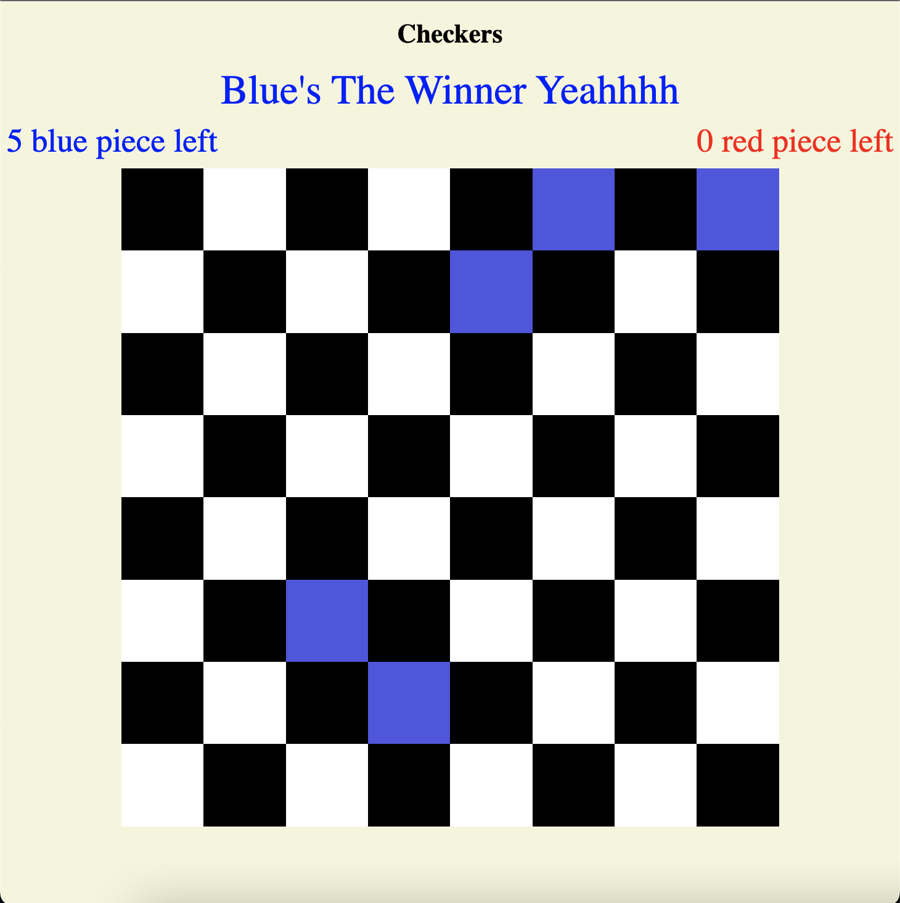

# 🔴 🔵 Checkers ⚫ ⚪

Checkers is played by two opponents on opposite sides of the game board. One player has dark pieces (usually black); the other has light pieces (usually white or red). Black moves first, then players alternate turns. A player cannot move the opponent's pieces. A move consists of moving a piece diagonally to an adjacent unoccupied square. If the adjacent square contains an opponent's piece, and the square immediately beyond it is vacant, the piece may be captured (and removed from the game) by jumping over it.

## About The Project ✅✅✅✅

### Instruction 👓

-   You can play it in this link [Checkers](https://github.com/SireKyah/New-Project-for-gs).

-   You can only move 1 tiles ahead of you horizontaly, you can't go to the black tiles

-   You can capture the piece by jumping over them and you can also capture pieces behind yours but only if the behind them is empty.

-   To win the game, your pieces must capture every enemy pieces.

## Program Used 📖📖📖

-   Javascript
-   Css
-   Html

## Lesson Learnt 🔍🔍🔍

-   Lots of DOM manipulations

## Game Screen Shot

#### This is the target design

#### This is the initial stage

#### This is the winning page

## Future Features 📝

-   add a reset botton
-   add a pop up text instead of just text.
-   add more style to make it look proper
-   maybe add a designated pieces design instead of just colour
-   maybe add a feature where you can see where you can move a pieces when clicked.
